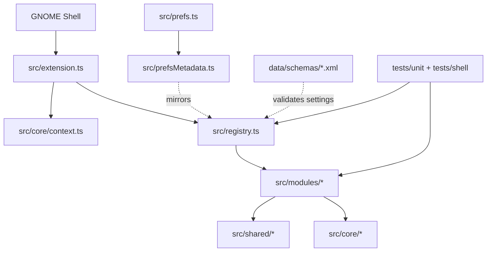
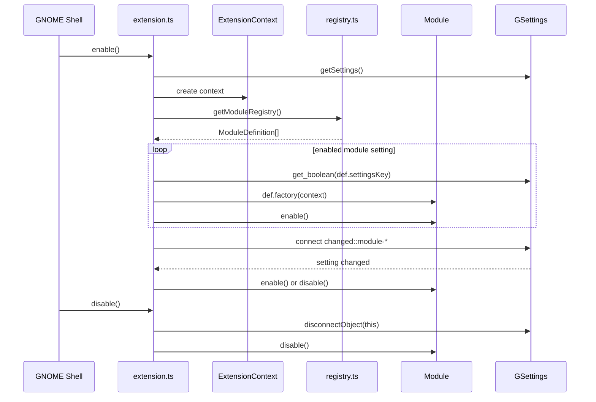
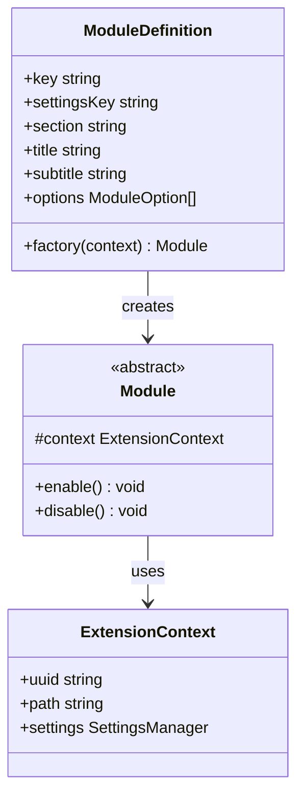
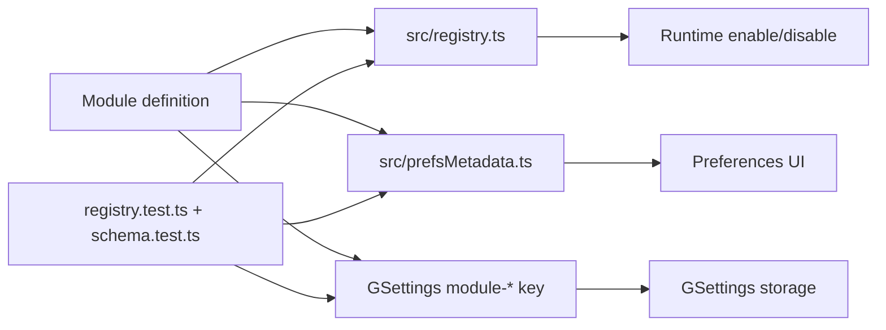
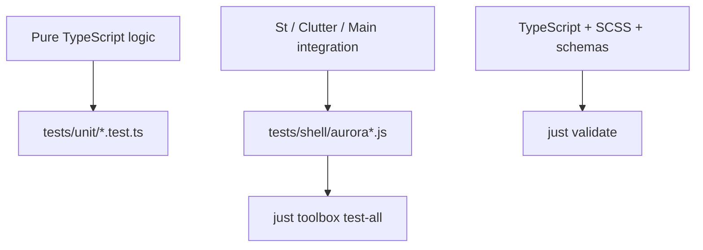
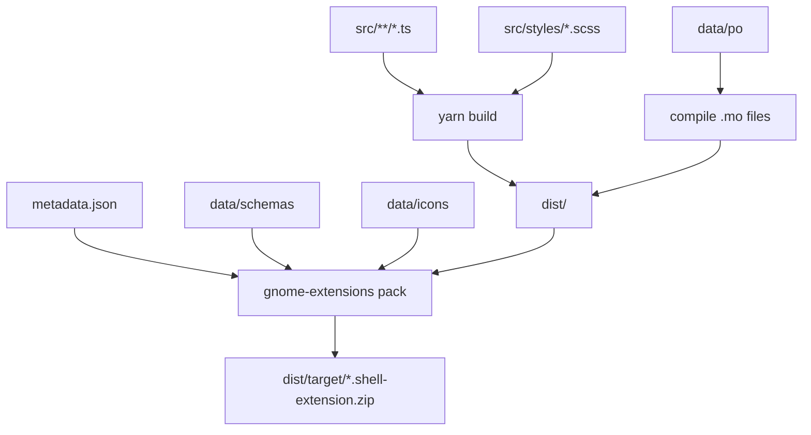

# Aurora Shell Architecture

Aurora Shell is a modular GNOME Shell extension. Regular features live as registry modules: each
module exports a colocated `definition` object and is instantiated by `src/extension.ts` through
`src/registry.ts`.

## Overview



## Source Layout

```text
src/
  core/                  Extension context, settings, and logging
  dev/                   Developer-only tools
  modules/               Feature modules registered in the extension
    ...                  One folder per regular Aurora module
  shared/                Utilities shared by modules
  styles/                SCSS partials compiled into Shell stylesheets
```

## Runtime Lifecycle



## Module Contract



Each module owns its runtime behavior and cleanup. `enable()` and `disable()` must stay symmetric:
actors, signal handlers, timeouts, D-Bus watches, and injected Shell UI must be removed by the same
module that created them.

## Registry And Preferences

Every registry module must stay in sync across:

- `src/registry.ts`
- `src/prefsMetadata.ts`
- `data/schemas/org.gnome.shell.extensions.aurora-shell.gschema.xml`



`tests/unit/registry.test.ts` and `tests/unit/schema.test.ts` enforce that parity. A module addition
is incomplete until all three places are updated.

## Test Boundaries



Keep heavy algorithms outside Shell imports when practical. Shell-facing code is expected to import
GNOME Shell internals directly and is verified through integration tests running a real headless
Shell session.

## Packaging



`just package` builds TypeScript and SCSS into `dist/`, compiles schemas and translations, then
packs the GNOME extension zip. Top-level generated directories imported at runtime must be listed as
extra sources in the `justfile`.
