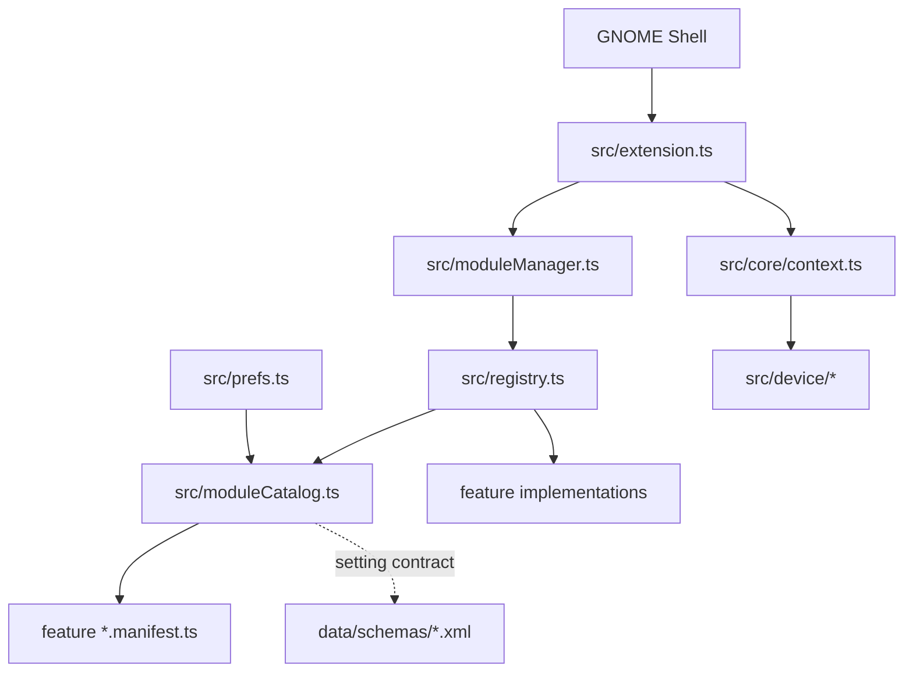

# Aurora Shell Architecture

Aurora Shell is a pragmatic modular GNOME Shell extension. Features remain grouped by functional
area (`dock`, `panel`, `desktop`, `privacy`, `clipboard`, `theme`, `patches`, and `shared`) and use
Shell APIs directly where appropriate.

## Overview


```mermaid
flowchart TD
  Shell[GNOME Shell] --> Extension[src/extension.ts]
  Extension --> Manager[src/moduleManager.ts]
  Extension --> Context[src/core/context.ts]
  Manager --> Registry[src/registry.ts]
  Registry --> Catalog[src/moduleCatalog.ts]
  Catalog --> Manifests[feature *.manifest.ts]
  Registry --> Modules[feature implementations]
  Prefs[src/prefs.ts] --> Catalog
  Context --> Device[src/device/*]
  Catalog -. setting contract .-> Schema[data/schemas/*.xml]
```

Manifests contain only presentation metadata and runtime policy, so preferences can load the same
catalog as the runtime without importing GNOME Shell UI modules. `registry.ts` is the sole mapping
from manifest keys to runtime factories.

## Runtime Lifecycle

`ModuleManager` owns module instances, setting subscriptions, runtime compatibility, failure
isolation, reconciliation after device/topology changes, and reverse-order teardown. Modules keep
the intentionally small `enable()` / `disable()` contract.

`LifecycleScope` owns signal connections and explicit teardown callbacks for one enable/disable
cycle. Teardown is reverse-order and idempotent. Timers, D-Bus subscriptions, and other stateful
resources remain explicit at their call sites.

## Device And Display Runtime

`DeviceService` maintains a reactive snapshot containing:

- device class (`phone`, `tablet`, `laptop`, `desktop`, or `unknown`);
- input mode (`touch`, `pointer`, `keyboard`, `mixed`, or `unknown`);
- logical monitor geometry, scale, orientation, built-in status, and display role;
- capabilities that are backed by real probes.

Display roles are `desktop`, `mobile`, and `unknown`; `shared` is not a hardware role. A module that
works on both declares both roles. Mobile-only topologies currently add a desktop runtime fallback,
so the existing desktop experience remains available until mobile surfaces are registered. Mixed
topologies retain both roles, allowing a built-in phone display and an external desktop display to
coexist later.

## Source Layout

```text
src/
  module.ts             Module, manifest, option, and runtime policy contracts
  moduleCatalog.ts      Ordered preference/runtime manifest catalog and sections
  moduleManager.ts      Runtime lifecycle and reconciliation
  registry.ts           Manifest-to-factory association
  core/                  Context, LifecycleScope, settings, and logging
  device/                Reactive detection plus pure classification
  clipboard/             Clipboard history module and UI
  desktop/               Desktop-only modules such as tray icons
  dock/                  Dock module, bindings, intellihide, and topology helpers
  panel/                 Panel, clocks, menus, and Quick Settings integrations
  patches/               Focused Shell behavior patches
  privacy/               Privacy and screen-sharing behavior
  shared/                Utilities and shared widgets
  theme/                 Theme and color-scheme modules
```

Complex Shell widgets keep pure calculations in Shell-free files where useful. Current examples
include device classification, Dash layout, monitor topology, tray state, and clock presentation.

## Adding A Module

1. Add `feature.manifest.ts` and the runtime implementation in the appropriate functional area.
2. Import the manifest into `moduleCatalog.ts` in preference order.
3. Associate its factory in `registry.ts`.
4. Add its module and option keys to the GSettings schema.
5. Add unit and/or Shell integration coverage.

`registry.test.ts` inspects the TypeScript AST to enforce catalog/factory coverage and stable module
order. `schema.test.ts` structurally parses the XML and requires all manifest-declared setting keys
to match the schema exactly.

## Test Boundaries

Pure TypeScript logic belongs in `tests/unit`. St/Clutter/Main integration belongs in
`tests/shell`. Architectural changes are accepted only after `just validate`, `just unit-test`,
`just shexli`, and `just toolbox test-all`.

## Packaging

`just package` builds TypeScript and SCSS into `dist/`, compiles schemas and translations, and packs
the extension. Manifests stay as source modules; no TypeScript or XML generation step is involved.
