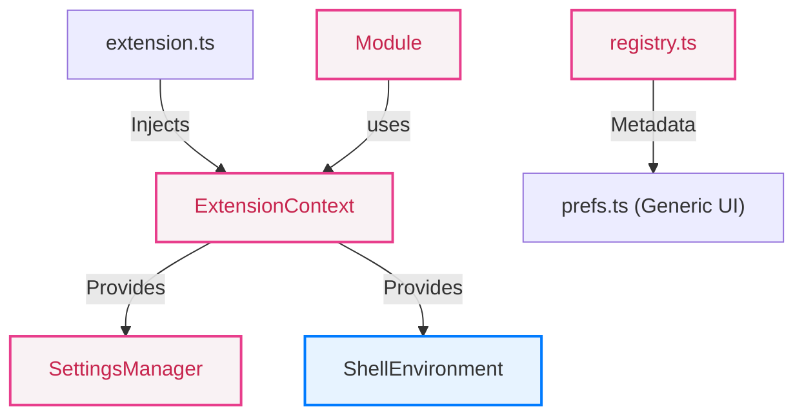

# Contributing to Aurora Shell

Thank you for your interest in contributing to Aurora Shell! This document outlines the project architecture and provides guidelines for adding new modules and adhering to the project's code style.

## Architecture Overview

Aurora Shell is designed to be highly modular. Each feature is an independent module that can be enabled or disabled by the user without affecting other features.



1.  **Dependency Injection:** `extension.ts` instantiates an `ExtensionContext` and injects it into every module. **Modules must never use GNOME Shell globals (like `Main`, `Gio.Settings`) directly.**
2.  **Abstractions:** 
    - Use `this.context.settings` to interact with GSettings.
    - Use `this.context.shell` for Shell-wide status (e.g., startup check, overview).
    - This allows for easier mocking during unit tests.
3.  **Layering:** Separate UI orchestration (Clutter actors) from pure business logic. Complex logic should be extracted into standalone TypeScript functions or classes.
4.  **Metadata-Driven Preferences:** The preferences UI is generated dynamically from `src/registry.ts`.

## Adding a Module

1. Create your module file at `src/modules/myModule.ts` extending `Module`:

```typescript
import { ExtensionContext } from "~/core/context.ts";
import { Module } from '~/module.ts';

export class MyModule extends Module {
  constructor(context: ExtensionContext) {
    super(context);
  }

  override enable(): void { 
    // setup using this.context (e.g., this.context.settings.getBoolean('...'))
  }
  
  override disable(): void { 
    // cleanup
  }
}
```

2. Register the module in `getModuleRegistry` (`src/registry.ts`):

```typescript
{ 
  key: 'my-module', 
  settingsKey: 'module-my-module', 
  title: _('My Module'), 
  subtitle: _('Description'),
  options: [
    // (Optional) add sub-settings here
    { key: 'my-sub-key', title: _('Sub Setting'), subtitle: _('...'), type: 'switch' }
  ]
},
```

3. Add the module factory in `MODULE_FACTORIES` (`src/extension.ts`):

```typescript
import { MyModule } from "./modules/myModule.ts";

const MODULE_FACTORIES: Record<string, (ctx: ExtensionContext) => Module> = {
  // ...
  'my-module': (ctx) => new MyModule(ctx),
};
```

4. Add a GSettings toggle key (`data/schemas/org.gnome.shell.extensions.aurora-shell.gschema.xml`):

```xml
<key name="module-my-module" type="b">
  <default>true</default>
  <summary>Enable My Module</summary>
  <description>What this module does</description>
</key>
```

5. Build and verify:

```bash
just build
```

After these steps, your module should appear in Preferences and respect the runtime enable/disable toggles.

## Build System & Commands

- **Build:** `just build` — installs deps, compiles TypeScript and SCSS, copies metadata/schemas, compiles `.mo` files
- **Install:** `just install` — builds + packages as `.zip` + installs to GNOME Shell
- **Quick update:** `just quick` — rebuild + rsync files to extension dir (skips full install)
- **Run (host):** `just run` — build + install + launch a devkit GNOME Shell session
- **Type-check:** `just validate` — runs `tsc` without emitting output
- **Lint:** `just lint` — runs ESLint
- **Unit tests:** `just unit-test` — runs unit tests via vitest (no GNOME Shell required)
- **Single integration test:** `just test <script>` — runs one shell test headlessly with `gnome-shell-test-tool`
- **All integration tests:** `just test-all` — builds and runs all shell tests, printing a pass/fail summary
- **Watch SCSS:** `just watch` — watches `src/styles/` and recompiles on change

*Note: For a full test environment, you can create a Fedora toolbox via `just toolbox create` and run session testing inside it using `just toolbox run`.*

## CI

Every push and pull request runs the CI pipeline defined in `.github/workflows/ci.yml`. It has four jobs:

1. **Lint & type-check** — runs `yarn validate` and `yarn lint`
2. **Unit & regression tests** — runs `yarn test:unit` (vitest, no GNOME Shell needed)
3. **Build** — runs `just package` and uploads the extension `.zip` as an artifact (depends on lint)
4. **Integration tests** — runs all `tests/shell/aurora*.js` scripts against a headless GNOME Shell inside a Fedora container (depends on build + unit tests)

All jobs must pass before a PR can be merged.

## Coding Standards

- **File names:** `camelCase.ts`
- **Classes:** `PascalCase`
- **Private members:** `_prefixed`
- **Constants:** `UPPER_CASE`
- **Symmetry:** Everything connected in `enable()` **must** be disconnected or destroyed in `disable()`.
- **Dependency Injection:** Strictly follow DI; do not reach out to globals.
