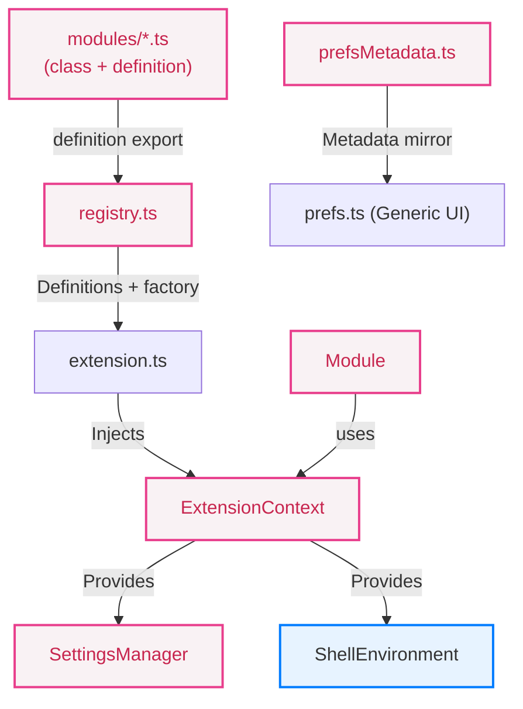

# Contributing to Aurora Shell

Thank you for your interest in contributing to Aurora Shell! This document outlines the project architecture and provides guidelines for adding new modules and adhering to the project's code style.

## Architecture Overview

Aurora Shell is designed to be highly modular. Each feature is an independent module that can be enabled or disabled by the user without affecting other features.



1.  **Dependency Injection:** `extension.ts` instantiates an `ExtensionContext` and injects it into every module. **Modules must never use GNOME Shell globals (like `Main`, `Gio.Settings`) directly.**
2.  **Abstractions:**
    - Use `this.context.settings` to interact with GSettings.
    - Use `this.context.shell` for Shell-wide status (e.g., startup check, overview).
    - This allows for easier mocking during unit tests.
3.  **Layering:** Separate UI orchestration (Clutter actors) from pure business logic. Complex logic should be extracted into standalone TypeScript functions or classes.
4.  **Self-Registering Modules:** Each module file exports a `definition: ModuleDefinition` co-located with its class, including the factory that constructs it. `src/registry.ts` is a pure aggregator — it imports every `definition` and returns them in UI order. `extension.ts` iterates the registry and calls `def.factory(ctx)` directly; no central factory map exists.
5.  **Metadata-Driven Preferences:** The preferences UI is generated dynamically from `src/prefsMetadata.ts`, a hand-maintained metadata mirror. Prefs cannot import `registry.ts` because it runs in `gnome-extensions-app` (GTK/Adw), which cannot resolve `resource:///org/gnome/shell/*` imports pulled in transitively by module classes. Parity between `registry.ts`, `prefsMetadata.ts`, and the GSettings schema is enforced by `tests/unit/registry.test.ts`.

## Adding a Module

1. Create `src/modules/myModule/myModule.ts` with a `Module` subclass **and** a co-located `definition` export. Every module **must** live in its own folder named after the module (e.g., `dock/dock.ts`, `trayIcons/trayIcons.ts`). For complex modules, split supporting logic into sibling files inside that folder (e.g., `trayIcons/sniHost.ts`, `trayIcons/trayContainer.ts`):

```typescript
import { gettext as _ } from 'gettext';

import type { ExtensionContext } from '~/core/context.ts';
import type { ModuleDefinition } from '~/moduleDefinition.ts';
import { Module } from '~/module.ts';

export class MyModule extends Module {
  constructor(context: ExtensionContext) {
    super(context);
  }

  override enable(): void {
    // setup using this.context (e.g., this.context.settings.getBoolean('...'))
  }

  override disable(): void {
    // cleanup
  }
}

export const definition: ModuleDefinition = {
  key: 'my-module',
  settingsKey: 'module-my-module',
  title: _('My Module'),
  subtitle: _('Description'),
  options: [
    // (Optional) add sub-settings here
    { key: 'my-sub-key', title: _('Sub Setting'), subtitle: _('...'), type: 'switch' },
  ],
  factory: (ctx) => new MyModule(ctx),
};
```

2. Register the definition in `src/registry.ts` — one import line plus one array entry (preserve UI order):

```typescript
import { definition as myModule } from '~/modules/myModule/myModule.ts';

export function getModuleRegistry(): ModuleDefinition[] {
  return [
    // …existing modules…
    myModule,
  ];
}
```

3. Mirror the metadata into `src/prefsMetadata.ts`. Prefs runs in a separate process that cannot statically import module source files — see the comment at the top of `prefsMetadata.ts` for the full explanation:

```typescript
{
  key: 'my-module',
  settingsKey: 'module-my-module',
  title: _('My Module'),
  subtitle: _('Description'),
  options: [
    { key: 'my-sub-key', title: _('Sub Setting'), subtitle: _('...'), type: 'switch' },
  ],
},
```

4. Add a GSettings toggle key (`data/schemas/org.gnome.shell.extensions.aurora-shell.gschema.xml`):

```xml
<key name="module-my-module" type="b">
  <default>true</default>
  <summary>Enable My Module</summary>
  <description>What this module does</description>
</key>
```

5. Build and verify:

```bash
just build
just unit-test
```

`tests/unit/registry.test.ts` parses each module's `definition`, `prefsMetadata.ts`, `registry.ts`, and the schema XML. It fails if any of the four drift out of sync (missing key, duplicate settingsKey, mismatched order, missing schema entry, etc.), so a half-finished module addition is caught immediately.

After these steps, your module appears in Preferences and respects the runtime enable/disable toggles.

## Branching & Release Model

Aurora Shell follows a branching model aligned with GNOME Shell's own release cycle.

### Branches

| Branch | Purpose |
|--------|---------|
| `main` | Active development targeting the next GNOME release |
| `release/v50.x` | Maintenance branch for GNOME 50 |
| `release/v51.x` | Maintenance branch for GNOME 51 |

Maintenance branches are created automatically when the first tag for a new major version is pushed.

### New features

Each major Aurora Shell release targets a single GNOME Shell version. New features land on `main` and are released alongside a new major GNOME Shell version.

Branches targeting already-released GNOME Shell versions are in maintenance mode. **Do not add new features to maintenance branches** — they are strictly for bug fixes and compatibility updates.

### Bug fixes

Bug fixes should target `main` first via a normal PR. If the fix is relevant to a maintenance release, open a **separate PR targeting that branch**:

```bash
git checkout release/v50.x
git cherry-pick <commit-sha>
# open a PR targeting release/v50.x
```

Maintainers decide which fixes are worth backporting. Not every fix needs to land in every maintenance branch.

### Automated backports

To request a maintenance backport, add a label such as `GNOME 50` to the original pull request.
GitHub Actions creates or updates a separate backport PR targeting `release/v50.x`.

The backport branch is rebuilt from the target release branch, cherry-picks the original PR commits,
and adds a final version bump commit. For example, if `metadata.json` on `release/v50.x` says
`50.7`, the generated backport PR bumps it to `50.8`.

### Release candidates

Release candidates are published alongside GNOME Shell RCs. Tags follow the pattern `v50-rc1`, `v50-rc2`, etc. RC releases are automatically marked as **pre-releases** on GitHub.

### Stable releases

Stable releases use tags like `v50.1`, `v50.2`, matching the GNOME Shell major version they target.

To publish a release, create an annotated tag and push it:

```bash
git tag -a v50.1 -m "Release v50.1"
git push origin v50.1
```

The CI pipeline runs all tests and, if they pass, publishes the GitHub Release automatically.

## Build System & Commands

- **Install deps:** `just deps` — runs `yarn install`; use once or when updating packages
- **Build:** `just build` — compiles TypeScript and SCSS, copies metadata/schemas, compiles `.mo` files
- **Package:** `just package` — packs the extension as a `.zip` in `dist/target/` (depends on `build`)
- **Install:** `just install` — installs the already-packaged `.zip` to GNOME Shell (requires `just package` first)
- **Full install:** `just full-install` — packages + installs in one step
- **All:** `just all` — clean + full-install
- **Uninstall:** `just uninstall` — disables and removes the extension
- **Run (host):** `just run` — launches a devkit GNOME Shell session (headless, Wayland)
- **Validate:** `just validate` — runs tsc, ESLint, Prettier check, and Stylelint
- **Lint:** `just lint` — runs ESLint only
- **Unit tests:** `just unit-test` — runs unit tests via vitest (no GNOME Shell required)
- **Coverage:** `just coverage` — runs unit tests with coverage report
- **Single integration test:** `just test <script>` — packages and runs one shell test headlessly
- **All integration tests:** `just test-all` — packages and runs all shell tests on the host, printing a pass/fail summary
- **Shexli review scan:** `just shexli` — packages the extension and runs the extensions.gnome.org static analyzer on the generated ZIP
- **Watch SCSS:** `just watch` — watches `src/styles/` and recompiles on change
- **View logs:** `just logs` — shows recent `aurora` entries from the current boot journal
- **Clean:** `just clean` — removes `dist/`
- **Deep clean:** `just distclean` — removes `dist/` and `node_modules/`

*For a full test environment, create a Fedora toolbox via `just toolbox create` and run tests inside it using `just toolbox test-all` (preferred over `just test-all`).*

## GNOME Extensions Review

Aurora Shell can be checked locally with Shexli, the experimental static analyzer used by
extensions.gnome.org:

```bash
just shexli
```

The recipe depends on `just package` and scans the generated
`dist/target/aurora-shell@luminusos.github.io.shell-extension.zip`. Install Shexli with
`python3 -m pip install --user shexli`, or install `uvx` and the recipe will run
`uvx --from shexli shexli` automatically.

## CI

Every push to `main` and every pull request runs the CI pipeline defined in `.github/workflows/ci.yml`. It has four jobs:

1. **Validate** — runs tsc, ESLint, Prettier check, and Stylelint via `just validate`
2. **Unit & regression tests** — runs `yarn test:unit` (vitest, no GNOME Shell needed)
3. **Build** — runs `just package` and uploads the extension `.zip` as an artifact (depends on lint)
4. **Integration tests** — runs all `tests/shell/aurora*.js` scripts against a headless GNOME Shell inside a Fedora container (depends on build + unit tests)

All jobs must pass before a PR can be merged.

When a version tag (`v50.1`, `v50-rc1`, etc.) is pushed, `.github/workflows/release.yml` calls the CI pipeline and, if all jobs pass, publishes the GitHub Release automatically.

## Coding Standards

- **File names:** `camelCase.ts`
- **Classes:** `PascalCase`
- **Private members:** `_prefixed`
- **Constants:** `UPPER_CASE`
- **Symmetry:** Everything connected in `enable()` **must** be disconnected or destroyed in `disable()`.
- **Dependency Injection:** Strictly follow DI; do not reach out to globals.

## Logging Style

Always prefix log messages with the module name in `[PascalCase]` brackets. Use the global `logger` from `~/core/logger.ts` for all logging — do not call `console.log/warn` or `GLib.log_structured` directly from module code.

```typescript
import { logger } from '~/core/logger.ts';

// Correct
logger.log('[AuroraTray] Item added: ' + id);
logger.warn('[IconWeave] No match found for ' + wmClass);

// Wrong — redundant prefix, wrong casing, or bypasses logger
logger.log('[Aurora Shell] [aurora-tray] Item added: ' + id);
console.warn('[aurora-shell] Something failed');
```

The `[Aurora Shell]` prefix is redundant: the SYSLOG_IDENTIFIER in structured logs already routes output to the right extension in the journal.
