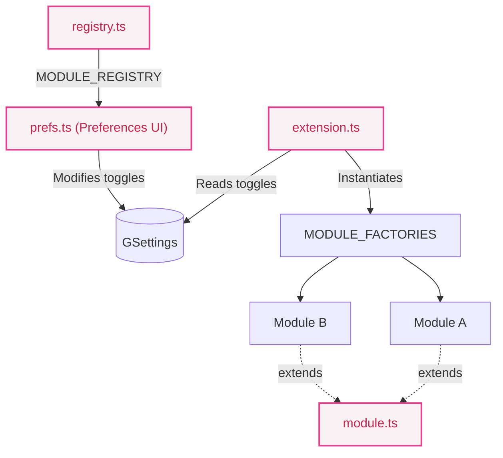

# Contributing to Aurora Shell

Thank you for your interest in contributing to Aurora Shell! This document outlines the project architecture and provides guidelines for adding new modules and adhering to the project's code style.

## Architecture Overview

Aurora Shell is designed to be highly modular. Each feature is an independent module that can be enabled or disabled by the user without affecting other features.



1. `extension.ts` is the GNOME Shell extension entry point. It instantiates all enabled modules from `MODULE_FACTORIES` on `enable()` and disposes them on `disable()`.
2. Each feature is an independent class that extends `Module` and implements `enable()` and `disable()`.
3. `MODULE_REGISTRY` in `registry.ts` drives the preferences UI — every module must be registered here.
4. GSettings keys (in `schemas/`) control per-module toggles from the preferences panel.
5. The build toolchain (esbuild + Sass) targets **GJS 1.73.2+ / Firefox 102** (ESM format).

## Adding a Module

Adding a module is quick. You wire it in once, and Aurora handles lifecycle + preferences automatically.

1. Create your module file at `src/modules/myModule.ts` extending `Module`:

```typescript
import { Module } from './module.ts';

export class MyModule extends Module {
  override enable(): void { 
    // setup (e.g. connect signals, add actors)
  }
  
  override disable(): void { 
    // cleanup (mirror enable - disconnect signals, destroy actors)
  }
}
```

2. Register the module in `MODULE_REGISTRY` (`src/registry.ts`) so it appears in Preferences:

```typescript
{ 
  key: 'my-module', 
  settingsKey: 'module-my-module', 
  title: _('My Module'), 
  subtitle: _('Description of what this module does') 
},
```

3. Add the module factory in `MODULE_FACTORIES` (`src/extension.ts`):

```typescript
import { MyModule } from "./modules/myModule.ts";

const MODULE_FACTORIES: Record<string, () => Module> = {
  // ...
  'my-module': () => new MyModule(),
};
```

4. Add a GSettings toggle key (`data/schemas/org.gnome.shell.extensions.aurora-shell.gschema.xml`):

```xml
<key name="module-my-module" type="b">
  <default>true</default>
  <summary>Enable My Module</summary>
  <description>What this module does</description>
</key>
```

5. Build and verify:

```bash
just build
```

After these steps, your module should appear in Preferences and respect the runtime enable/disable toggles.

## Build System & Commands

- **Build:** `just build` — installs deps, compiles TypeScript and SCSS, copies metadata/schemas, compiles `.mo` files
- **Install:** `just install` — builds + packages as `.zip` + installs to GNOME Shell
- **Quick update:** `just quick` — rebuild + rsync files to extension dir (skips full install)
- **Run (host):** `just run` — build + install + launch a devkit GNOME Shell session
- **Type-check:** `just validate` — runs `tsc` without emitting output
- **Lint:** `just lint` — runs ESLint
- **Watch SCSS:** `just watch` — watches `src/styles/` and recompiles on change

*Note: For a full test environment, you can create a Fedora toolbox via `just toolbox create` and run session testing inside it using `just toolbox run`.*

## Coding Standards

- **File names:** `camelCase.ts`
- **Classes:** `PascalCase`
- **Private members:** `_prefixed`
- **Constants:** `UPPER_CASE`
- Keep `enable()` and `disable()` symmetric — everything connected or created in `enable()` **must** be disconnected or destroyed in `disable()`.
- Avoid importing GJS global modules at the top level in code paths that run in multiple processes; use lazy / conditional imports where needed.
