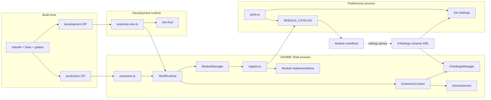
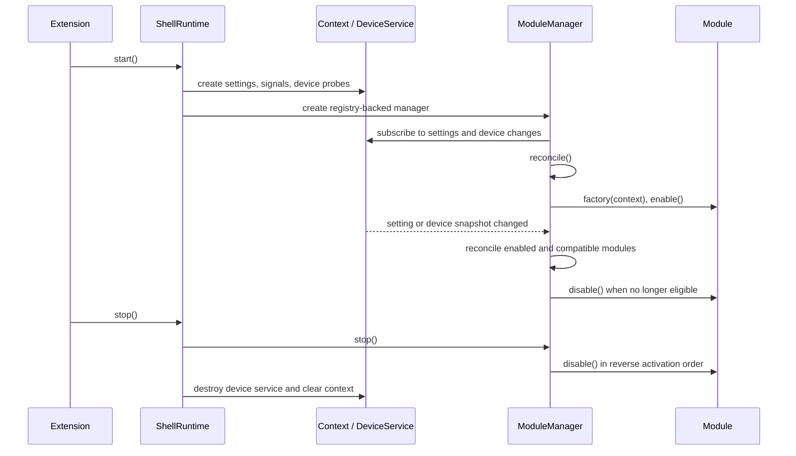
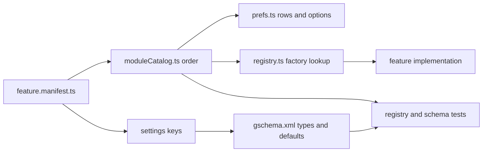
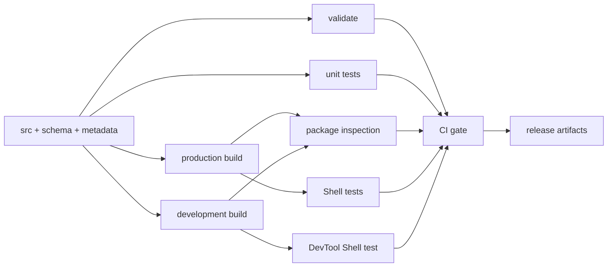

# Architecture

Aurora Shell has two installed entry points and two development-only layers. Preferences code must
not import Shell libraries, and production packages must not carry contributor tools.

## Components and process boundaries

`src/extension.ts` creates and stops `ShellRuntime`. `src/prefs.ts` runs separately under GTK/Adwaita
and reads only catalog metadata plus GSettings. GTK and Adw belong in preferences; Clutter, Meta,
Shell, and St belong in the Shell process.

`src/extension.dev.ts` is the development entry point. It starts the same `ShellRuntime` and adds
DevTool only when `AURORA_DEVTOOLS=1`. Package inspection ensures the production ZIP uses the normal
entry point and omits development files.

## Startup, reconciliation, and shutdown

For each catalog definition, reconciliation combines two facts:

1. The module's GSettings switch is enabled.
2. `moduleSupportsRuntime()` accepts the active display roles and probed capabilities.

A module factory or `enable()` failure is logged, and the manager asks a constructed instance to
disable. Later modules continue only when that cleanup returns normally; a cleanup or disable
exception is surfaced and stops the current reconciliation or shutdown pass. `ModuleManager` removes
an active instance from its map before calling `disable()`, so a later reconciliation can attempt a
clean enable. Module `disable()` methods must therefore tolerate partial enable and repeated
lifecycle cycles without throwing.

## Device snapshots, display roles, and capabilities

`DefaultDeviceService` produces a snapshot from Shell monitor data, input presence, backlight,
orientation sensors, ModemManager, and D-Bus name ownership. A snapshot contains:

- device class: `phone`, `tablet`, `laptop`, `desktop`, or `unknown`;
- input mode: `touch`, `pointer`, `keyboard`, `mixed`, or `unknown`;
- logical monitor geometry, scale, orientation, built-in status, and role;
- probed capabilities: `touch`, `accelerometer`, `light-sensor`, `proximity-sensor`, `cellular`, and
  `backlight`.

External monitors have the `desktop` role. A built-in monitor is `mobile` on a phone or tablet,
`desktop` on a laptop or desktop, and otherwise `unknown`. Until mobile-specific module surfaces are
registered, a mobile-only topology also receives the desktop fallback role. Mixed topologies retain
both roles.

Manifest runtime policy defaults to desktop role and session scope. A `requires` list is conjunctive:
every named capability must exist. The current catalog does not declare capability requirements, so
modules that depend on an optional service handle absence inside their own lifecycle.

## One metadata flow

Tests check the module contract across these files:

- The manifest owns the stable module key, settings switch, section, labels, options, internal
  settings, and runtime policy.
- `MODULE_CATALOG` owns user-visible order and is safe to import from preferences.
- `registry.ts` is the only manifest-key-to-factory map.
- The schema owns value types and defaults. No generator copies data between these files.
- `prefs.ts` selects a native preferences row from each option type.
- `registry.test.ts` and `project/schema.test.ts` parse the TypeScript and XML to reject drift.

See the [module guide](modules.md) for the change sequence and the
[module reference](module-reference.md) for the current catalog.

## Resource ownership

GNOME review rules require everything created or connected during `enable()` to be undone during
`disable()`. Aurora Shell uses two ownership styles:

- `LifecycleScope` owns signal handlers and explicit cleanup callbacks for one enable cycle. It
  disposes callbacks in reverse registration order and is idempotent.
- Widgets and domain objects own their child actors, cancellables, D-Bus subscriptions, and other
  resources, then release them from `destroy()` or the module's `disable()`.

`ManagedSource` and `ManagedTimeout` bind replaceable GLib sources to a lifecycle scope. Direct
resources remain explicit when the local owner is clearer. Never rely on a callback eventually
returning `GLib.SOURCE_REMOVE`; GNOME requires active sources to be removed during disable.

The outer teardown order is manager lifecycle subscriptions, active modules in reverse order,
device service, context, then icon search paths. This reverses startup and avoids callbacks into
already-destroyed dependencies.

## Tests and package flow

Pure calculations and structural contracts run under Node in `tests/unit`. GNOME Shell behavior runs
as `.test.js` scripts under `gnome-shell-test-tool` in `tests/shell`. The production package is used
for normal Shell tests; the development package is tested separately with `AURORA_DEVTOOLS=1`.

Toolbox uses the same `Containerfile` inputs as CI. The CI runner adds a private runtime directory,
system D-Bus, and logind/GDM mocks before running the production and DevTool suites. See
[Testing](testing.md) for the selection matrix and runner diagnostics.

## Architectural invariants

- Importing an entry point or constructing the extension creates no Shell objects or signal
  connections; work begins in `enable()`.
- Preferences never import Shell-only libraries or runtime module implementations.
- Every catalog key has exactly one registry factory and one schema switch.
- Every manifest option or internal setting has exactly one schema key.
- A factory or enable failure with successful cleanup does not prevent later modules from starting;
  a thrown cleanup or disable error stops the current manager pass.
- Every enable cycle has a complete, repeatable disable path.
- Production and development packages use the same runtime; only the development entry point adds
  DevTool.
- Production packages contain reviewable JavaScript, schemas, translations, styles, licenses, and
  required assets, not TypeScript or build tooling.

## Change impact map

| Change                       | Inspect and update                                          | Minimum evidence                                               |
| ---------------------------- | ----------------------------------------------------------- | -------------------------------------------------------------- |
| New or renamed module        | manifest, catalog, registry, schema, module reference       | registry, schema, and documentation tests                      |
| New option                   | manifest and schema; preferences only for a new option type | schema and relevant unit test                                  |
| Module lifecycle or Shell UI | implementation, owner teardown, Shell test                  | unit test where logic is pure; targeted Shell test             |
| Device role or capability    | `src/device`, runtime policy consumers, module manager      | device and module-manager unit tests; affected Shell test      |
| Preferences rendering        | manifest metadata and `src/prefs.ts`                        | unit/validation plus manual preferences check                  |
| Build or package contents    | scripts, entry points, package inspection                   | `just package check` and Shexli                                |
| Workflow or release behavior | workflow YAML and release runbook                           | actionlint through CI workflow checks; dry-run/review evidence |

Use [Testing](testing.md) to expand the minimum evidence when a change crosses more than one row.
